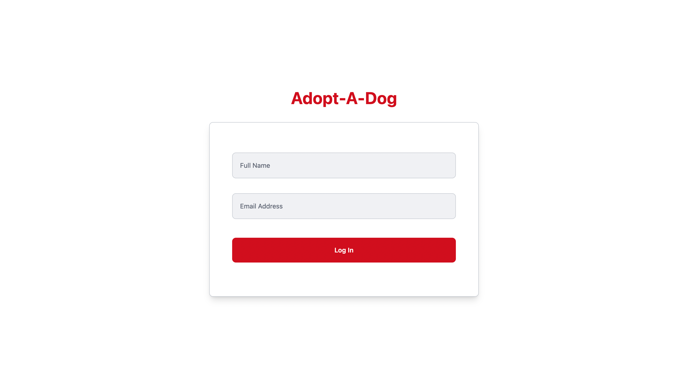
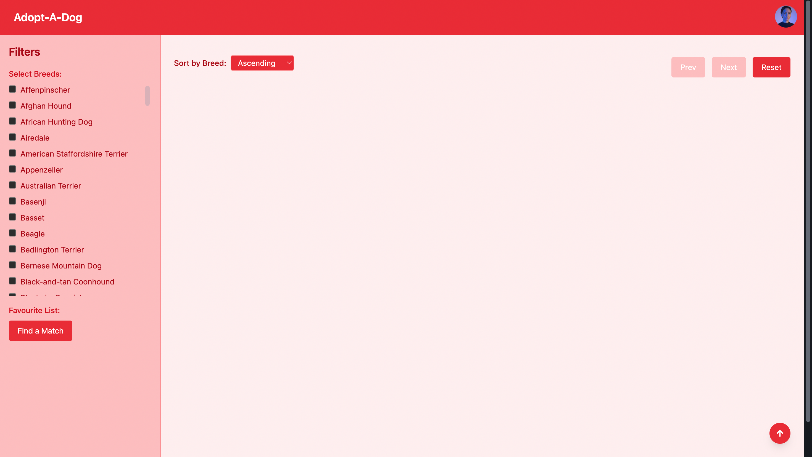

# 🐾 Fetch Frontend Take-Home: Adopt-A-Dog

Welcome to my submission for the Fetch Frontend Take-Home Project. This React app helps dog lovers search, favorite, and match with shelter dogs through a clean, interactive UI built using modern tools and best practices.

---

## 🚀 Features Implemented

### ✅ User Authentication
- Users must log in with their name and email via `POST /auth/login`.
- Auth token is stored as an `HttpOnly` cookie (`fetch-access-token`).
- Protected routing prevents access to `/dogs/search` after logout.

### ✅ Breed Filter
- Breed list is fetched using `GET /dogs/breeds`.
- Users can select multiple breeds to filter search results.

### ✅ Dog Search with Pagination & Sorting
- Dogs are fetched via `GET /dogs/search`.
- Full dog details are fetched via `POST /dogs`.
- Results are paginated and sorted by breed (asc/desc toggle).
- Each page shows 24 dogs.

### ✅ Favorites with Like Button ❤️
- Users can like dogs, which are stored in a `Map<string, Dog>`.
- Favorite dogs are visually marked and can be unliked from the list or sidebar.

### ✅ Match Generation
- Favorited dog IDs are sent to `POST /dogs/match`.
- The returned match is shown in a modal with dog details and a close ✕ button.

### ✅ Scroll-To-Top Button
- Always-visible FAB scrolls the page to the top when clicked.

### ✅  Location Data
- Integrated with `/locations` API to enrich dog data.
- Maps ZIP codes to: **City**, **State**, **County**, **Latitude**, **Longitude**.
- Location info displayed on each `DogCard`.
- Used `Map<string, string[]>` for efficient ZIP-to-location lookup.

---

## 📸 Screenshots

### 🔐 Login Page


### 🐶 Initial Home Page


### 🐶 Breed Filter Home Page


### 🐶 Descending Filter Home Page


### ❤️ Favorite Home Page


### ❤️ Match Modal


### 🐶 Displaying with location


---

## 🧠 Tech Stack

- **React (Vite) + TypeScript**
- **Tailwind CSS** for styling
- **Axios** for API communication
- **React Router** for navigation
- **React Context** for authentication state
- **React Icons** for UI icons (heart, arrow, etc.)

---


### 🧠 Why I Didn't Use Redux

For this project, I chose not to use Redux to keep things simple and lightweight. The app only requires a few local state variables to manage things like selected breeds, favorites, and authentication. Using Redux would have added unnecessary complexity for such a small scope.

React’s built-in `useState` and `useContext` were more than enough to manage the state cleanly and effectively.

If the app grows in complexity, Redux or another global state manager can be added later.


## 🛠️ Setup & Running Locally

```bash
git clone https://github.com/your-username/fetch-dog-app.git
cd fetch-dog-app
npm install
npm run dev
